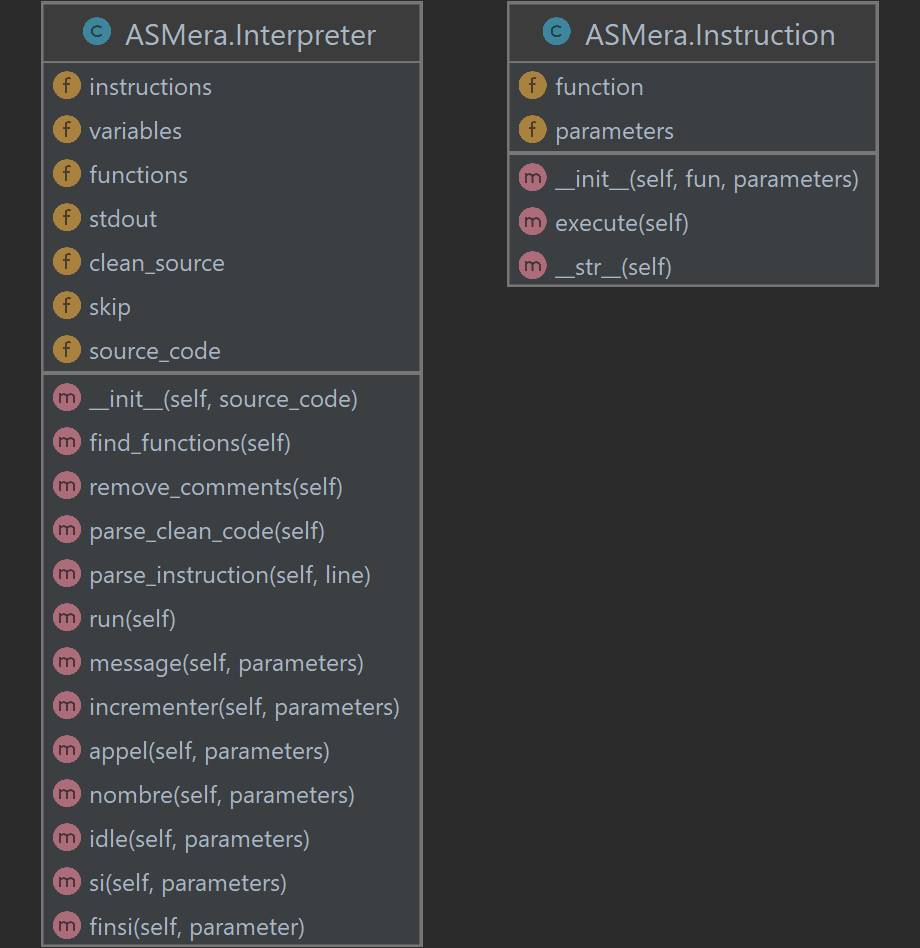

# ASMera

- Started on: 2022-11-09
- Last Modified: 2022-19-09

---
- CorentinGoet 
- corentin.goetghebeur@ensta-bretagne.org

---
Challenge Info:
- Category: Dev
- Difficulty: Hard
- Score: 200 points

---

## Challenge

Nous avons besoin de sécuriser des données sur un très vieux système.

Heureusement, nous avons déjà de nombreux programmes très sophistiqués pour le faire.

Nous avons cependant égaré l'interpreteur du langage de programmation interne à notre organisation.

Veuillez programmer l'interpreteur ASMera en Python, suivant les entrées et sorties d'exemple ci-dessous.

Le programme prend pour seul argument le fichier à executer et affiche le résultat en sortie standard.

### Included Files

- [Input Example](Files/example_input.txt)
- [Output Example](Files/example_output.txt)

## Write-Up

We have to develop an interpreter for the custom assembly language used in the example using Python.

To run my interpreter ([ASMera.py](python/ASMera.py)) use the command:

```bash
python3 ASMera.py <input_file>
```

The output is printed on the standard output.

### Analysis of the custom language

The different instructions in this custom language are:

- **message** : writes one or multiple strings to the standard output (print),
- **incrementer**: increment the value of the variable given as first parameter with the number given as second parameter (+=),
- **appel**: calls the function given as parameter

Like PHP or Bash, you have to use '$' in front of your variable name to access its value.

#### Functions

The functions are written in the following way:

```asmera
function_identifier:
instruction
instruction
[...]
instruction
retour
```

#### Control flow

You can use 'if' statements to control the order of execution:

```asmera
si condition
instruction
[...]
instruction
finsi
```

Only simple conditions with 2 operands and 1 operator will be taken into consideration:
- `$variable_name <= 12` -> OK
- `($variable_name > 12) && ($second_variable == 0)` -> ERROR

#### Comments

The comments start with a ';' and end at the end of the line.

```asmera
; this is a comment
```

### Implementation

To solve this challenge, I used a Python program made of 2 classes:
- Instruction
- Interpreter



The interpretation of the program given as parameter is done in the following way:
- removing comments
- parsing the source file to find functions
- build Instruction objects from the instruction contained in the functions
- build Instruction objects from the instructions outside of functions
- execute instructions outside of functions

#### Functions

In the interpreter, functions are stored in a `dict`, the name of the function is mapped to a list of Instructions.

When the function is called, each Instruction in the list is executed.

#### Control Flow
The "si" instruction is implemented using a boolean variable called `skip`. When the interpreter finds a "si" instruction, if the condition is true, nothing happens and the interpreter keeps going. If the condition is false, every following instruction is skipped.

When the interpreter finds a "finsi" instruction, the `skip` variable is set to false.