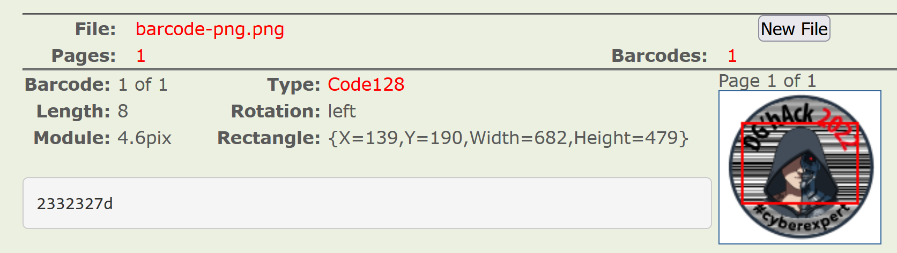
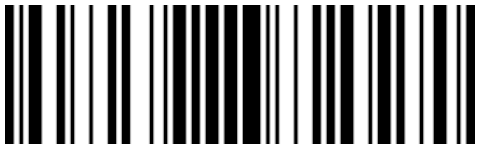
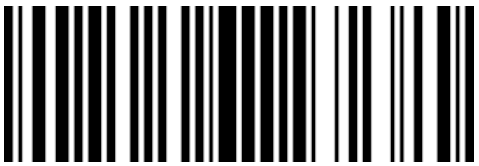

# Is it art

- Started on: 2022-11-18
- Last Modified: 2022-11-18

---
- CorentinGoet 
- corentin.goetghebeur@ensta-bretagne.org

---
Challenge Info:
- Category: Steganography
- Difficulty: Easy
- Score: 42 points

---

## Challenge

Rendez-vous au stand DGA lors de l’European Cyber Week 2022 qui se tiendra à Rennes, un challenge se cache dans un des goodies qui vous seront offerts.

Saurez-vous le retrouver et le résoudre ?


## Write-Up

First, this is a steganography challenge that can be solved with the physical version of the image so I will not look for hidden files or comments built into the png.

The first thing to notice is that the sticker does not have only one barcode with the logo in front of it, the width of the lines on each side do not match.

We can also see that on the top and bottom, the lines seem to all have the same width so this part is probably not a valid barcode.

We may have to scan each side of the logo separately.

First, by uploading the image to an online barcode reader (https://online-barcode-reader.inliteresearch.com/), we find:



The barcode scanner identified the type of barcode: Code128 and found something: 

```txt
2332327d
```

By converting from hexadecimal, we get:

```txt
#22}
```

this is very likely to be the end of the flag we are looking for.

By deforming the original picture using Paint, I get 2 bar codes:

Left half:


Right half:


With the left half, we get:
```txt
4447417b
```

hex for :
```txt
DGA{
```

And with the right one:
```txt
2332327d
```

hex for:
```txt
#22}
```

The flag is DGA{#22} !