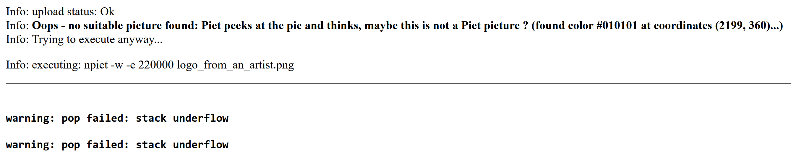
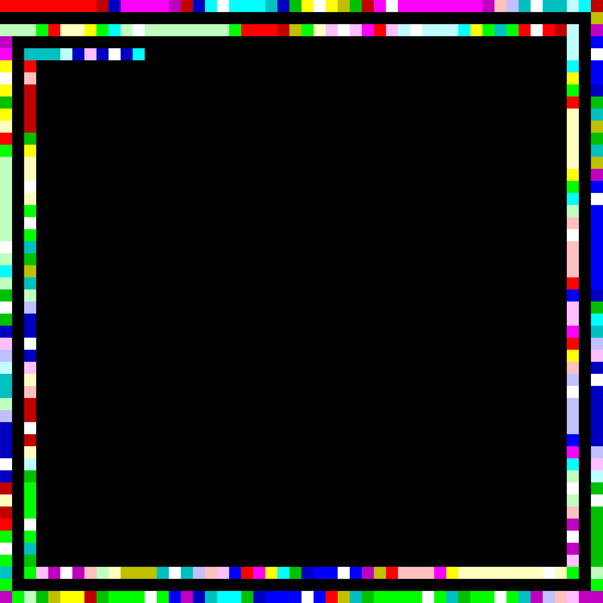
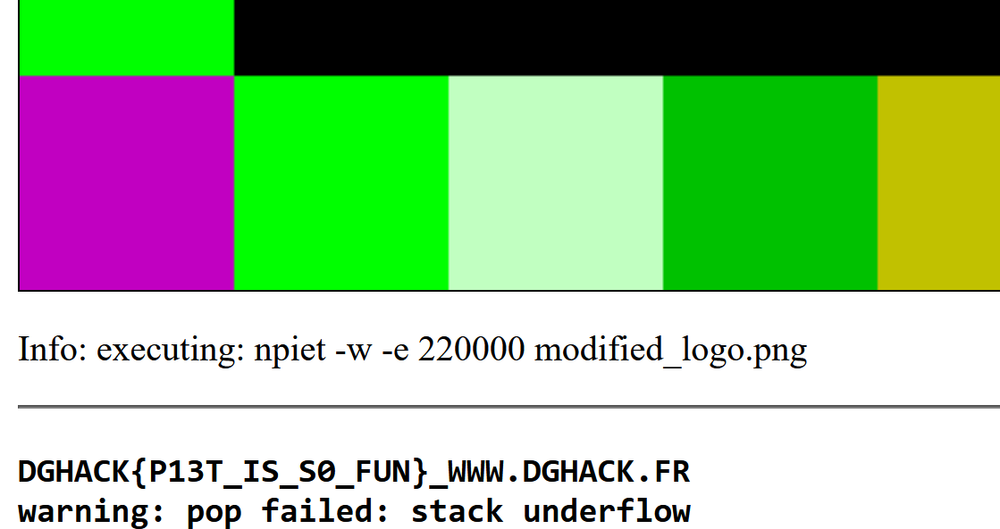

# Ne Jamais Renoncer

- Started on: 2022-11-09
- Last Modified: 2022-11-09

---
- CorentinGoet 
- corentin.goetghebeur@ensta-bretagne.org

---
Challenge Info:
- Category: Steganography
- Difficulty: Easy
- Score: 50 points

---

## Challenge

Le logo officiel du DG'hAck a été repris par un artiste de talent, mais pourquoi ?

## Write-Up

The colored squares around this logo are very typical for the esoteric programming language [Piet](https://esolangs.org/wiki/Piet).

I will try to use this programming language for this challenge.

To decode this picture, I used the online interpreter: http://www.bertnase.de/npiet/npiet-execute.php.

Decoding the original picture does not work because of the forbidden colors in the logo.

I covered the original logo in black using paint to prevent this issue.

By uploading this new version, we get:

And we got the flag: DGHACK{P13T_IS_S0_FUN}