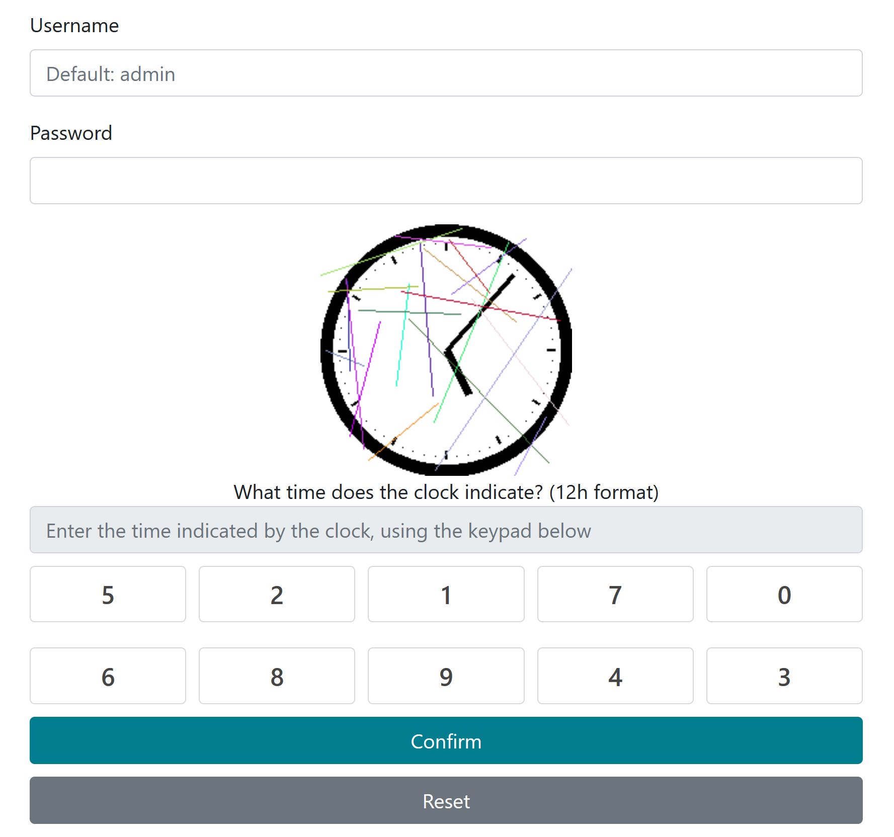
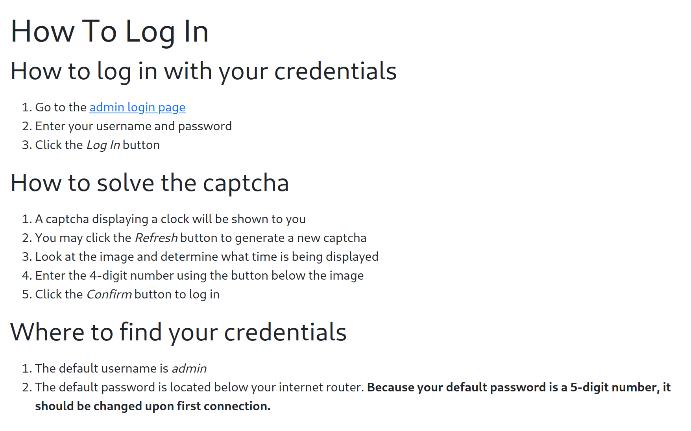
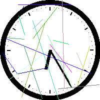
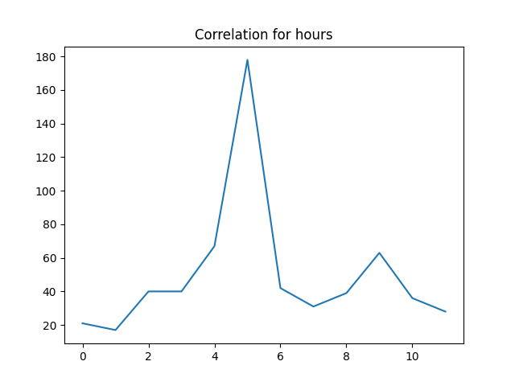

# Pas Si Chronophage

- Started on: 2022-11-20
- Last Modified: 2022-11-20

---
- CorentinGoet 
- corentin.goetghebeur@ensta-bretagne.org

---
Challenge Info:
- Category: dev
- Difficulty: medium
- Score: 100

---

## Challenge

Cette application permet la connexion de l'utilisateur à son compte de box internet.


## Write-Up

In this challenge, we have to connect through a login page with a captcha containing an image of an analog clock.



By entering a wrong captcha we get a link to a tutorial presenting how to login



This tutorial gives 2 important clues:
- the default login is **admin**
- the password is a **5-digit number**

Since the password is really simple, we can brute-force it to login.

The main problem is the captcha.

This write-up is divided in 2 parts (both are implemented in Python):
- reading the captcha
- brute-forcing the password

### Reading the captcha

The captcha images are random images of a clock with colored l lines to make the reading more challenging.



To read the time on these images, I compared the captcha image with 60 images generated by my script to find the minutes hand and then to 12 other images to find the hours hand.

This part of the challenge is handled by the [captcha_reader.py] program. This program works in 3 main steps:
- filtering the image to remove the colored lines - `filter` method
- generating pictures of clocks - `generate_clock` method
- computing correlation between the filtered image and the generated ones - `read_time` method




From the data collected during the execution of the script, I can say that my implementation of this method solved the captcha successfully in **88%** of requests and takes in average **0.25 seconds**.

### Brute-forcing the password

This part of the challenge is handled by the [PasSiChronphage.py] Python script.

First, to understand how the data is sent by the form, we can intercept the POST request (I used BurpSuite)

```
POST /login.php HTTP/1.1
Host: passichronophage.chall.malicecyber.com
User-Agent: Mozilla/5.0 (Windows NT 10.0; Win64; x64; rv:107.0) Gecko/20100101 Firefox/107.0
Accept: text/html,application/xhtml+xml,application/xml;q=0.9,image/avif,image/webp,*/*;q=0.8
Accept-Language: fr,fr-FR;q=0.8,en-US;q=0.5,en;q=0.3
Accept-Encoding: gzip, deflate
Content-Type: application/x-www-form-urlencoded
Content-Length: 60
Origin: http://passichronophage.chall.malicecyber.com
Connection: close
Referer: http://passichronophage.chall.malicecyber.com/index.php?error=wrong_credentials
Cookie: PHPSESSID=d4d9ff31ea63712916253d1cf351c494
Upgrade-Insecure-Requests: 1

username=YWRtaW4%3D&password=MTIzNDU%3D&captcha=NzE0Ng%3D%3D
```

For this request, the input was admin / 12345 / 11:59

We can see that the data is encoded in base 64 and, by decoding the data sent, we can read

The parameters are base 64 encoded, we get:
- admin
- 12345
- 7146

7146 is not the time we entered, so we need to understand where it comes from.

In the page source, we find this script:

```js
function addClickToInput(val, pos) {
  // remove the : from the input
  var input = document.getElementById('inputTime');
  if (input.value.length != 5) {
	document.getElementById('inputTime').value = "00:00";
	input = document.getElementById('inputTime');
  }
  var value = input.value;
  value = value.replace(':', '');
  new_value = value + val;
  // remove the first character
  new_value = new_value.substring(1, 3) + ':' + new_value.substring(3);
  document.getElementById('inputTime').value = new_value;
  var captchaInput = document.getElementById('captchaInput');
  if (captchaInput.value.length != 4) {
	document.getElementById('captchaInput').value += pos;
  } else {
  document.getElementById('captchaInput').value = captchaInput.value.substring(1, 4) + pos;
  }
}
function resetCaptcha() {
  document.getElementById('inputTime').value = '00:00';
  document.getElementById('captchaInput').value = 1;
}  
```

The input for the captcha is the position of the keys to enter, which have random positions.

So what we have to do is:
- read the name of the captcha from the page
- request the captcha image
- read the time from the captcha
- read from the page the position of each button
- encode the data in base 64
- send the login request

For each possible value of password.

For the HTTP requests I used the [httpx](https://www.python-httpx.org/) python library.

With both the requests and the captcha reading time, my program is able to tet

### Running the program

Since there are 100 000 different passwords to test, I ran 4 instances of the program in parallel.
The one in charge of passwords between 25 000 and 50 000 found the password after around 3 hours.

To run the program:

```bash
python3 PasSiChronophage.py [first_password] [last_password]
```

```txt
Trying Credentials: admin: 44188
Identified button positions: {'4': '0', '0': '1', '1': '2', '9': '3', '3': '4', '5': '5','8': '6', '6': '7', '2': '8', '7': '9'} 
Reading captcha...
Found: 9:38
Generated parameters: {'username': 'YWRtaW4=', 'password': 'NDQxODg=', 'captcha': 'MTM0Ng=='}
Login Request sent in 0.5047552585601807
Password identified: 44188 
Execution Time: 10927.633158922195
Captcha reader performance: 87.81%
```